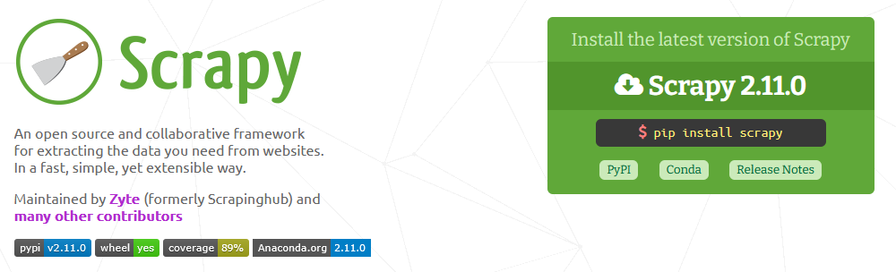
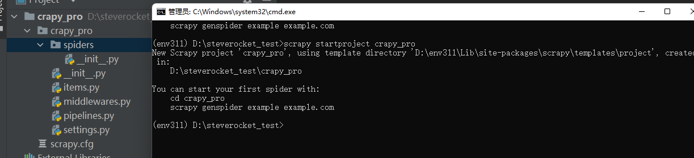
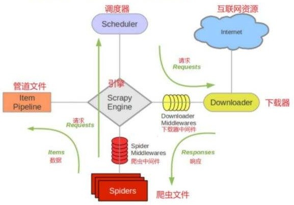

# Scrapy

### Scrapy

1. Scrapy是用 Python 实现的一个为了爬取网站数据、提取结构性数据而编写的爬虫应用框架，用途非常广泛。
2. Scrapy是一个用于爬取网站数据的Python框架。
3. 它采用了异步网络库Twisted和XPath解析器lxml，具有高效、灵活和可扩展的特点。
4. 可以应用在包括数据挖掘，信息处理或存储历史数据等一系列的程序中，也可以应用在获取API所返回的数据（例如 Amazon Associates Web Services ) 或者通用的网络爬虫。

Scrapy可以很方便的进行web抓取，并且可以很方便的根据自己的需求进行定制。

### 安装&使用

pip install scrapy

在开始爬取之前，必须创建一个新的Scrapy项目，需要注意的是：创建项目时，会在当前目录下新建爬虫项目的目录。

文件说明：

* scrapy.cfg：项目的配置信息，主要为Scrapy命令行工具提供一个基础的配置信息。（真正爬虫相关的配置信息在settings.py文件中）
* items.py：设置数据存储模板，用于结构化数据，如：Django的Model。
* pipelines：数据处理行为，如：一般结构化的数据持久化。
* settings.py：配置文件，如：递归的层数、并发数，延迟下载等。
* spiders：爬虫目录，如：创建文件，编写爬虫规则，比如执行命令：scrapy genspider douban movie.douban.com，则会在该目录下新建一个douban.py的文件。

Scrapy 使用了Twisted异步网络库来处理网络通讯，可以加快下载的速度，不用自己去实现异步框架。  
  
整体架构

Scrapy的整体架构包括以下几个主要组件：

1. 调度器（Scheduler）：负责接收和调度待爬取的请求，并按照一定的策略进行排序和去重。

2. 下载器（Downloader）：负责下载调度器发送的请求，并将响应返回给引擎。

3. 引擎（Engine）：负责控制整个爬取过程的流程，包括调度器和下载器之间的交互。

4. 解析器（Parser）：负责解析下载器返回的响应，提取出需要的数据。

5. 存储器（Pipeline）：负责对解析器提取的数据进行处理和存储，可以将数据保存到数据库、文件或其他存储介质中。

Scrapy的运行流程如下：

1. 引擎从调度器获取一个请求链接(URL)，用于接下来的抓取。
2. 引擎把URL封装成一个请求(Request)传给下载器。
3. 下载器根据请求下载网页（把资源下载下来），并封装成应答包(Response)，然后将响应返回给引擎。
4. 爬虫解析Response，引擎将下载器返回的响应发送给解析器进行解析，并提取出需要的数据。
5. 解析器将提取的数据（解析出实体（Item）），则交给实体管道进行进一步的处理（传递给存储器进行处理和存储）。
6. 如果有新的请求产生（解析出的是链接（URL）），引擎则将其（URL）发送给调度器，并继续进行下一轮的爬取。

通过以上的流程，Scrapy可以高效地爬取网站数据，并将其存储到指定的位置。同时，Scrapy还支持多线程和分布式的爬取方式，可以进一步提高爬取效率。

## 扩展

requests库 + bs4也可以解决，再麻烦点的就使用selenium解决js的异步加载问题。Python爬虫框架只有在遇到比较大型的需求时会用到，主要是为了方便管理以及扩展。

# 参考文章

