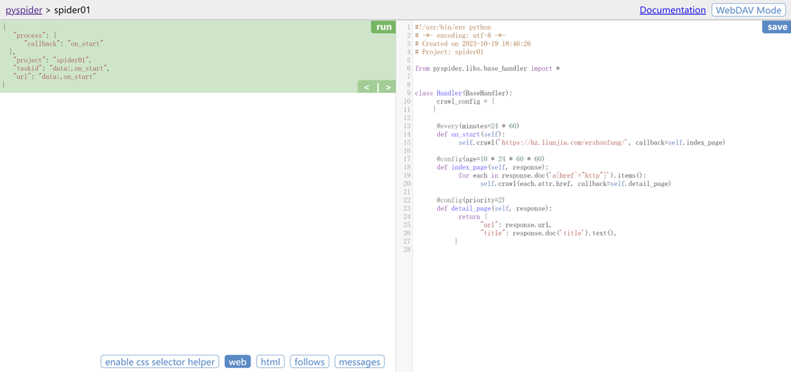

# PySpider

## PySpider

PySpider是binux做的一个开源的爬虫框架，实现了强大的网络爬虫系统，并自带有强大的webUI，分布式架构，支持多种数据库后端。

框架特性：

* Python（支持py2&py3）脚本控制，可以用任何你喜欢的html解析包（内置 pyquery）。
* WEB界面编写调试脚本，起停脚本，监控执行状态，查看活动历史，获取结果。
* 支持 MySQL, MongoDB, SQLite。
* 支持抓取 JavaScript 的动态页面。
* 组件可替换，支持单机/分布式部署，支持 Docker 部署。
* 拥有强大的调度控制。
  

安装好pyspider之后，打开cmd，输入pyspider，然后打开浏览器输入：http://localhost:5000，就可以进入pyspider的后台了。

第一次打开后台是一片空白的，点开浏览器后cmd不要关了，点击Create，随便输入一个名字（当然名字还是不要乱取）。

点击确定之后就进入一个脚本编辑器了

